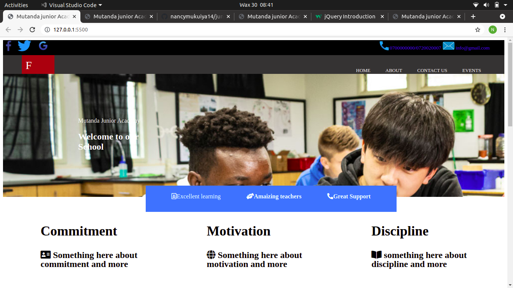
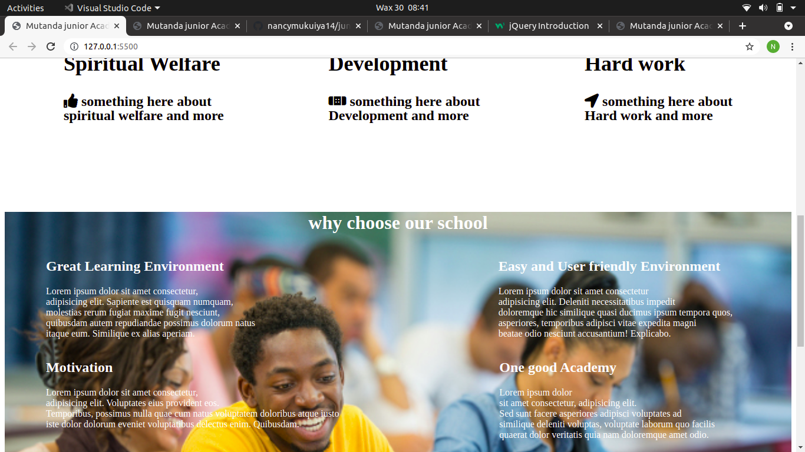

# PROJECT NAME;MUTANDA JUNIOR ACADEMY.
# AUTHOR OF THIS PROJECT IS:NANCY KIGOTHO
# DESCRIPTION.
* This is a school named mutanda junior academy home page.
* This project entails 2 files and one folder that has the images to be used in this project.
* it also has the contacts and the social media handles of the school on the navigation bar and on the footer
# INSTRUCTIONS.
* This prooject does not contain all the information about mutanda junior academy it is just an illustration of how the home page will look like.
* This project has two navigation bars and two footers.
# TECHNOLOGIES USED.
* HTML
* CSS
# CONTACT INFORMATION.
* if you have any questions about the project please contact me via nancykigotho14@gmail.com.
# REQUIREMENTS.
* Github.
* Git.
* web browser.
# GITHUB LINK
* This is the link of my project in my github account
https://github.com/nancymukuiya14/junior-Acadamy-project

# IMAGES

